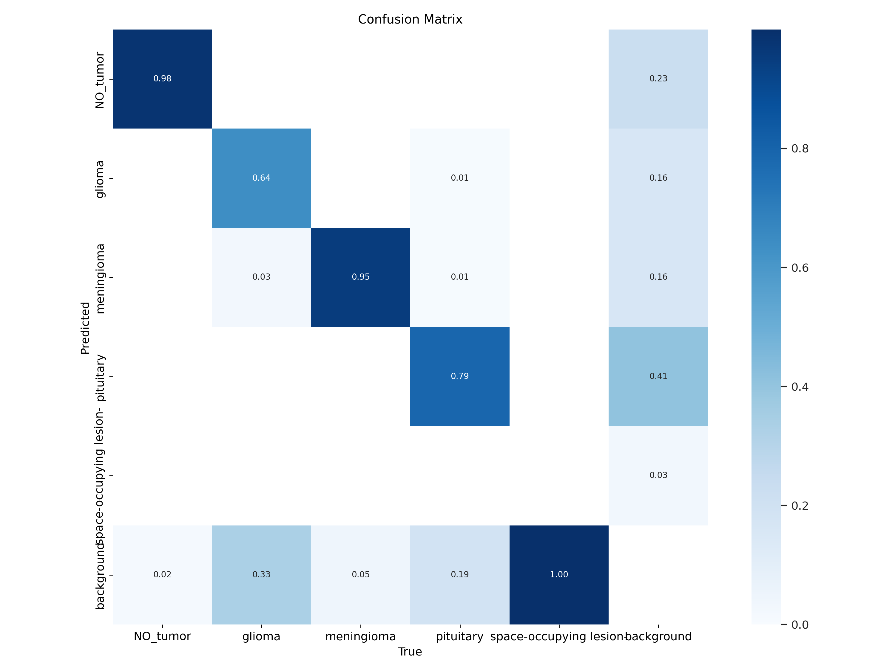

# Tumor Detection

This project uses a combination of state-of-the-art tools and libraries to train a YOLOv5 model for the task of tumor detection in MRI images. The project leverages Google Colab for execution, PyTorch for model development, and YOLOv5 for efficient object detection. It uses a structured workflow, including the installation of dependencies, model training, and result visualization, to develop a robust deep learning model for medical image analysis.

## YOLOv5

YOLOv5 (You Only Look Once version 5) is a real-time object detection model that’s widely used in computer vision applications for identifying and locating objects within an image or video. Developed by Ultralytics in 2020, YOLOv5 is part of the YOLO family of models, renowned for their balance of speed and accuracy, making them suitable for applications where real-time processing is crucial. While earlier versions of YOLO were developed in frameworks like Darknet, YOLOv5 is written entirely in PyTorch, making it more accessible, adaptable, and faster to deploy, especially for researchers and practitioners familiar with the PyTorch ecosystem. 
## Tools:
Python

Google Colab

YOLO v5

Pytorch

OpenCV

Matplotlib

## Confusion Matrix

