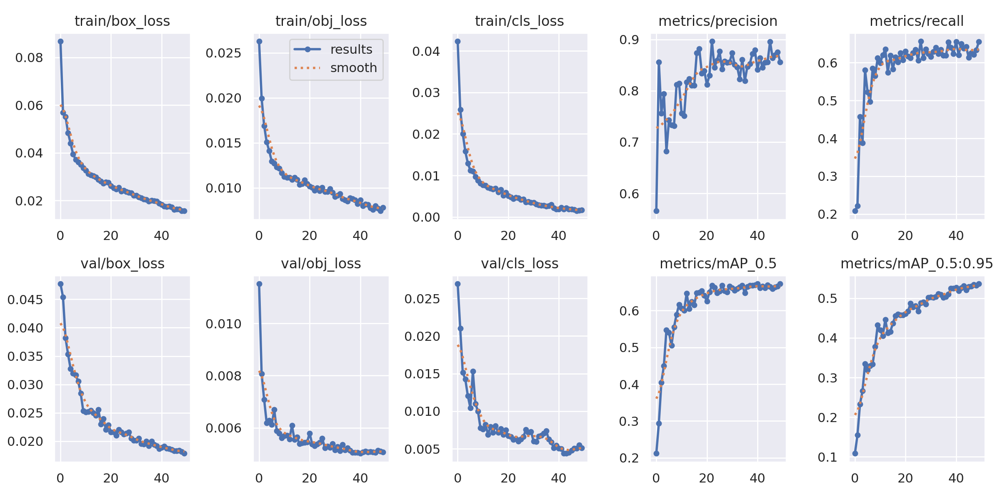

# Tumor Detection

This project uses a combination of state-of-the-art tools and libraries to train a YOLOv5 model for the task of tumor detection in MRI images. The project leverages Google Colab for execution, PyTorch for model development, and YOLOv5 for efficient object detection. It uses a structured workflow, including the installation of dependencies, model training, and result visualization, to develop a robust deep learning model for medical image analysis.

## What is Brain Tumor? 
A brain tumor is an abnormal growth of cells within the brain. It can either be benign (non-cancerous) or malignant (cancerous). Tumors in the brain can cause pressure, leading to serious issues like brain damage, and may be life-threatening. Early detection and treatment are crucial for managing brain tumors, with MRI scans commonly used for diagnosis and classification.

In this dataset, there are four main categories of images representing different types of brain scans with various types of tumors or no tumor presence. Here’s a description of each label type:

### NO_tumor:

These images contain brain scans that do not show any signs of a tumor. They are used as the baseline or negative class, indicating the absence of abnormalities in the brain tissues.

### Glioma:

Gliomas are a type of tumor that arises from glial cells in the brain, which support and protect neurons. These tumors can be malignant and vary in aggressiveness. In brain scan images, gliomas often appear as irregularly shaped masses with variations in tissue density, depending on their grade.

### Meningioma:

Meningiomas are tumors that form in the meninges, which are the protective layers surrounding the brain and spinal cord. They are usually benign, although some can become malignant. Meningiomas in scans typically appear as well-defined, lobulated masses on the surface of the brain, often near the skull.

### Pituitary:

Pituitary tumors, or pituitary adenomas, occur in the pituitary gland at the base of the brain. These tumors can affect hormone production, causing various physical symptoms. Pituitary tumors often appear as small, rounded lesions in brain scans, located centrally near the brain's base.

### Space-occupying lesion:

This label includes any lesions that occupy space in the brain, possibly indicating tumors, abscesses, cysts, or hemorrhages. These lesions can vary widely in appearance and location. The label can include both benign and malignant masses that affect surrounding brain tissue due to their size or position.

### With labels in YOLO format, each labeled image in this dataset will have a bounding box annotation for the tumor region, using the YOLO structure: [class_id, x_center, y_center, width, height]. This format allows each type of tumor (e.g., glioma, meningioma) and non-tumor images to be processed effectively for object detection, where the labels specify the category and location of the tumor in each image.

## YOLOv5

YOLOv5 (You Only Look Once version 5) is a real-time object detection model that’s widely used in computer vision applications for identifying and locating objects within an image or video. Developed by Ultralytics in 2020, YOLOv5 is part of the YOLO family of models, renowned for their balance of speed and accuracy, making them suitable for applications where real-time processing is crucial. While earlier versions of YOLO were developed in frameworks like Darknet, YOLOv5 is written entirely in PyTorch, making it more accessible, adaptable, and faster to deploy, especially for researchers and practitioners familiar with the PyTorch ecosystem. 
## Tools:
Python

Google Colab

YOLO v5

Pytorch

OpenCV

Matplotlib

## Model Training and Validation Performance

In this project, I utilized YOLOv5 for tumor detection in MRI images. The workflow began by setting up the environment and installing the necessary dependencies. After preparing the dataset with the tumor.yaml configuration, the model was trained using the yolov5s.yaml architecture for 50 epochs with a batch size of 8. The model's performance was then evaluated, and the best-performing model was exported to TorchScript and ONNX formats for deployment. This process ensures efficient tumor detection for medical applications.

The training and validation metrics over 50 epochs for the object detection model indicate effective learning and generalization. Key observations include:

### Losses (Top and Bottom Left Panels)
Training Losses: The train/box_loss, train/obj_loss, and train/cls_loss curves decrease consistently, indicating improvements in bounding box localization, objectness, and classification.
Validation Losses: The val/box_loss, val/obj_loss, and val/cls_loss curves show a similar downward trend as the training losses, suggesting that the model generalizes well with no signs of overfitting.

### Precision and Recall (Top Right Panels)
The metrics/precision and metrics/recall metrics exhibit an upward trend, stabilizing near 0.9 and 0.6, respectively. This demonstrates that the model’s accuracy in detecting objects improves and reaches a stable performance level over the epochs.

### Mean Average Precision (mAP) Scores (Bottom Right Panels)
The metrics/mAP_0.5 and metrics/mAP_0.5:0.95 scores increase steadily, reaching approximately 0.8 and 0.5, respectively. These mAP scores indicate enhanced detection accuracy across various Intersection over Union (IoU) thresholds, reflecting robust model performance.

### Summary
Overall, the model shows strong convergence and balanced performance across training and validation data. Declining loss curves and rising precision, recall, and mAP scores indicate effective learning and minimal overfitting, highlighting the model's readiness for deployment.

